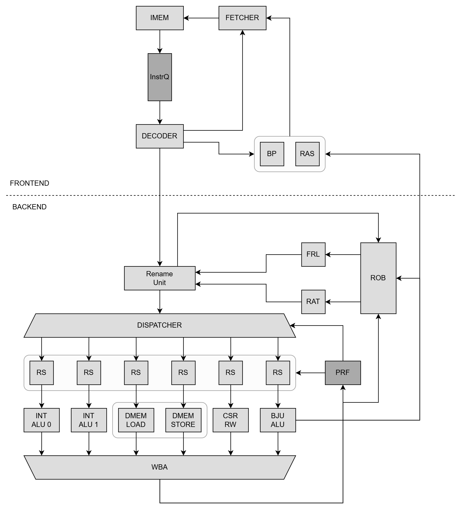

= Terem Core Specification
:doctype: book
:toc:
:toclevels: 2
:sectnums:

== Abbreviations

This chapter presents abbreviations which are widely used across all of the document.

.Used abbreviations
[options="autowidth", width="100%"]
|===
|Abbreviation |Full form  |Short description

|TRMC
|Terem Core
|Name of the described product

|IQ
|Instruction Queue
|Module that holds instructions waiting for their processing

|RU
|Rename Unit
|Module that renames architectural registers to a physical ones

|RAT
|Register Alias Table
|Module that holds current renaming of the registers

|PRF
|Physical register file
|Module that holds data for all physical registers

|RS
|Reservation station
|Module that holds instructions waiting for their operands readiness

|ALU
|Arithmetic-logic unit
|Common name for modules that executes arithmetic and logical operations with the data

|ROB
|Reorder Buffer
|Module that holds in-flight instructions

|RAS
|Return Address Stack
|Module used for jump prediction

|CSR
|Control and status register
|Common name for registers that controls and indicates the status of the core

|PE
|Processing Element
|Common name for modules that process the data (includes ALU)
|===

== Overview

This chapter gives a brief overview of Terem Core, its features and supported extensions.

=== Features

TBD

=== Suported Extensions

Terem Core implements 32-bit RISC-V ISA.

.Supported extensions
[options="autowidth", width="100%"]
|===
|Extension |Short description

|I
|Base extension for RISC-V
|===

== Microarchitecture

This chapter shows microarchitecture of Terem Core and it's internals and makes clear the implementation aspects.

=== Top level

.Pipeline stages
[options="autowidth", width="100%"]
|===
|Pipeline Stage |Short description

| TRMC0: Fetch
| Instructions are fetched from instruction memory and stored into IQ

| TRMC1: Decode
| Instructions selected from IQ are decoded, branch prediction process is started if any instruction is branch

| TRMC2: Rename
| Architectural registers for each decoded instruction are remapped to physical registers depending on RM, branch prediction process is finished, ROB entries are allocated

| TRMC3: Dispatch
| Instuctions are dispatched to a wakeup buffer or issue buffer of a related RSs depending on type of their PE and physical registers readiness

| TRMC4: Wakeup
| Instructions are moved from wakeup buffer to an issue buffer inside RS

| TRMC5: Issue
| Ready instructions are issued

| TRMC6: Execute
| Instructions are executed

| TRMC7: Writeback
| Instruction result are written back to a PRF and ROB being notified that instruction are executed

| TRMC8: Commit
| Instructions are commited, ROB entries are deallocated, physical registers are released
|===

This diagram presents top-level microarchitecture of Terem Core.

.Top level microarchitecture diagram

[NOTE]
This diagram depicts Terem Core as a functional blocks and does not accurately represents pipeline stages.

=== Modules

This chapter describes modules used in Terem Core, their functionality and mechanisms of work.

==== Instruction Fetcher

TBD

==== Instruction Queue

TBD

==== Decoder

TBD

==== Rename Unit

TBD

==== Dispatcher

TBD

==== Reservation Station

TBD

==== Writeback Arbiter

TBD

==== Reorder Buffer

TBD

==== Physical Register File

TBD

==== Register Alias Table

TBD

==== Free Registers List

TBD

==== Branch Predictor

TBD

==== Return Address Stack

TBD

==== Processing Elements

This chapter describes processing elements used for data processing in Terem Core.

===== Int ALU

TBD

===== Branch and Jump ALU

TBD

===== CSR Block

TBD

===== Load-Store Unit

TBD

=== Mechanisms

This chapter describes main mechanisms used by pipeline in Terem Core.

==== Instruction issuing

TBD

==== Instruction tag assignment

TBD

==== Exception handling

TBD

==== Free registers distribution

TBD

==== Stall propagation

TBD

==== Flush propagation

TBD

== Control and Status Registers

TBD

== External interfaces

TBD

== Parametrization

TBD
Add all parameters from YAML
